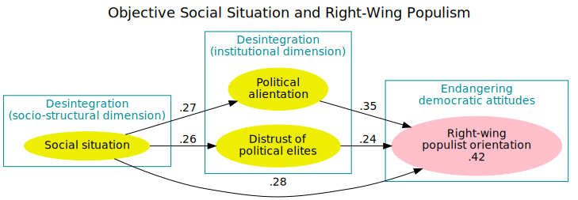

# sketchify

A command line tool to convert SVG files into sketchy looking ones.

This tool is a translation of [rough.js](http://roughjs.com) into C++! All credits belong to the original authors, all errors and glitches may have been introduced by me during that translation. I also left out a few parts of the original source code.

Why would you translate that into another language? I really love the look of rough.js. So much that I wanted to use it on a Rasperry Pi project. But unfortunatelly I used an old Pi 1 for that and I had not enough resources for a full Node.js environment. All the other parts of the project had been written in C++...

## Example

The input SVG was this:

## Usage

     sketchify -o example/sample-out.svg example/sample-in.svg

If no arguments are given sketchify reads from stdin and outputs to stdout, thus it can be used in a pipe as well.

| Parameter                           | Description                                                                |
| ----------------------------------- | -------------------------------------------------------------------------- |
| `-b, --bowing=number`               | numerical value indicating how curvy the lines are                         |
| `--curve-fitting=ratio`             | number (0-1) indicating how close curves follow original curves            |
| `--curve-step-count=number`         | number of points to estimate the shape                                     |
| `--curve-tightness=ratio`           | number (0-1) indicating how thight curve-points follow the original points |
| `--disable-multi-stroke`            | don't apply multiple strokes to sketch a shape                             |
| `--disable-multi-stroke-fill`       | don't apply multiple strokes to sketch the hachure lines filling a shape   |
| `--hachure-angle=angle`             | angle of hachure                                                           |
| `--hachure-gap=distance`            | gap between hachure lines                                                  |
| `-m, --max-randomness-offset=units` | maximum number of units a point will be translated                         |
| `-o, --out=file`                    | place the output into file                                                 |
| `-r, --roughness=number`            | numerical value indicating how rough the drawing is                        |
| `-w, --stroke-width=width`          | width of sketchy strokes                                                   |

## Build

You need to install the following build dependencies:

- `g++` with C++20 support (GCC >= 8)
- `expat` developer package (Debian/Ubuntu: `libexpat1-dev`, RedHat/Fedora: `expat-devel`, OpenSUSE/OpenMandriva: `libexpat-devel`)

Then it's nothing more than:

    make

Install the result (with root-privileges):

    sudo make install

## License

As the original code is just slightly modified, I shouldn't even talk about copyright. Nonetheless it is available under the [MIT License](LICENSE) - just like the original code.
